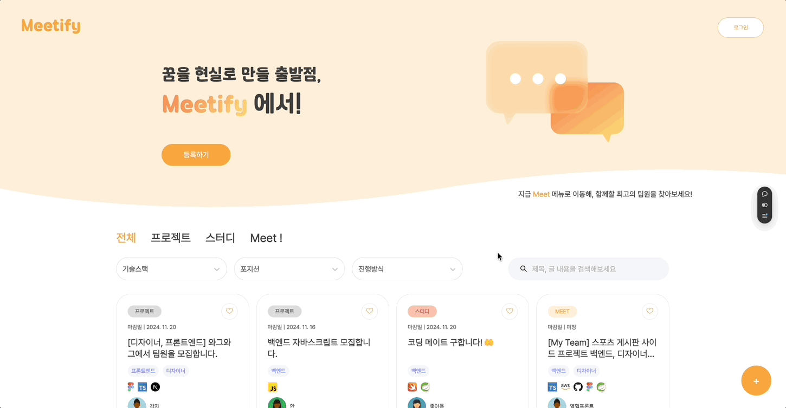
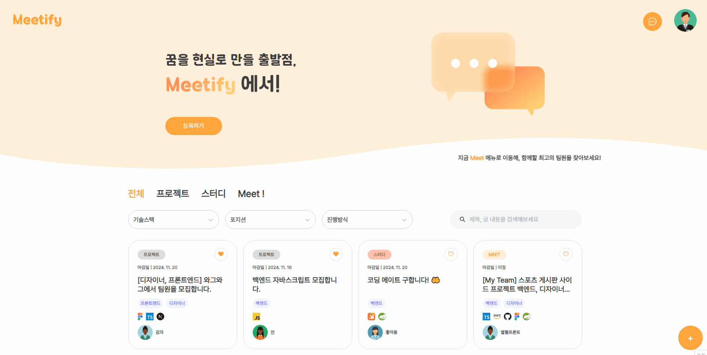
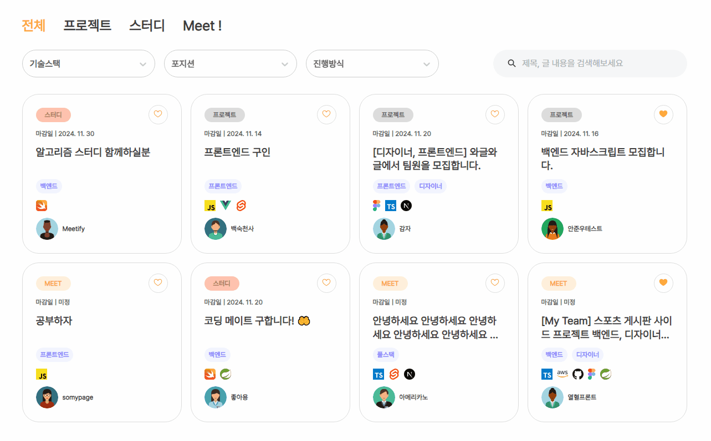
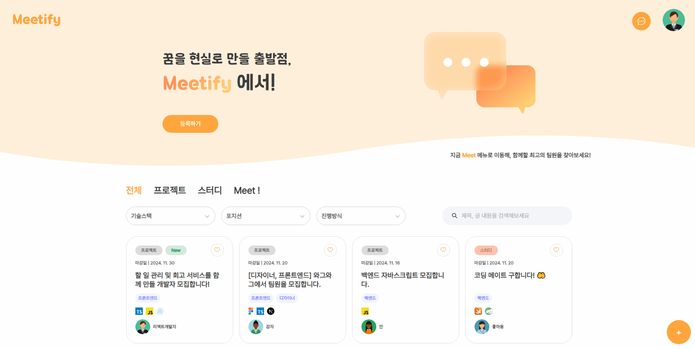
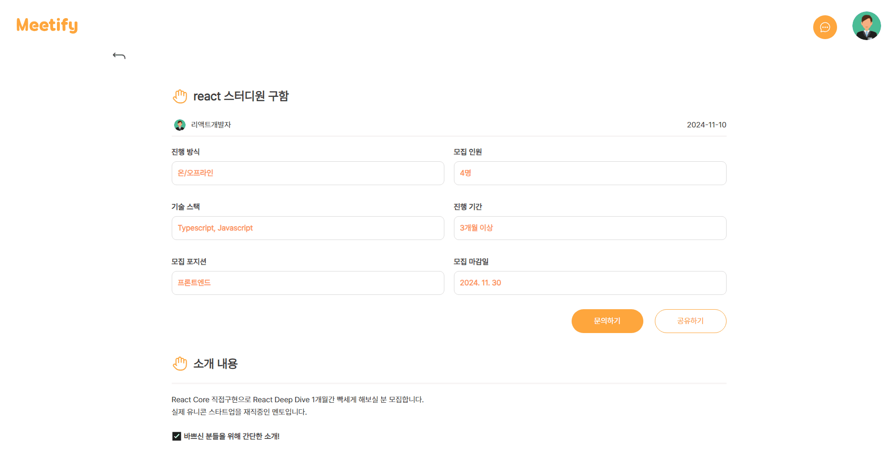
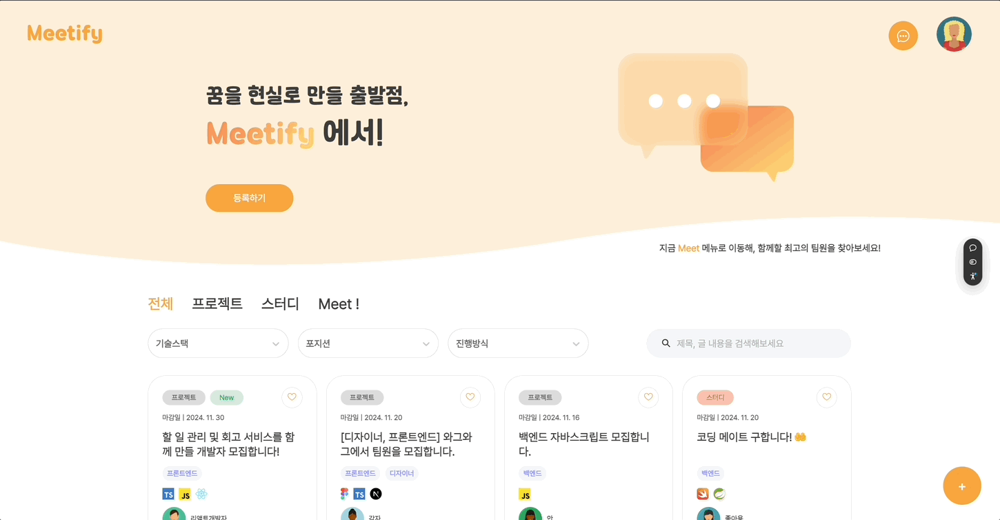
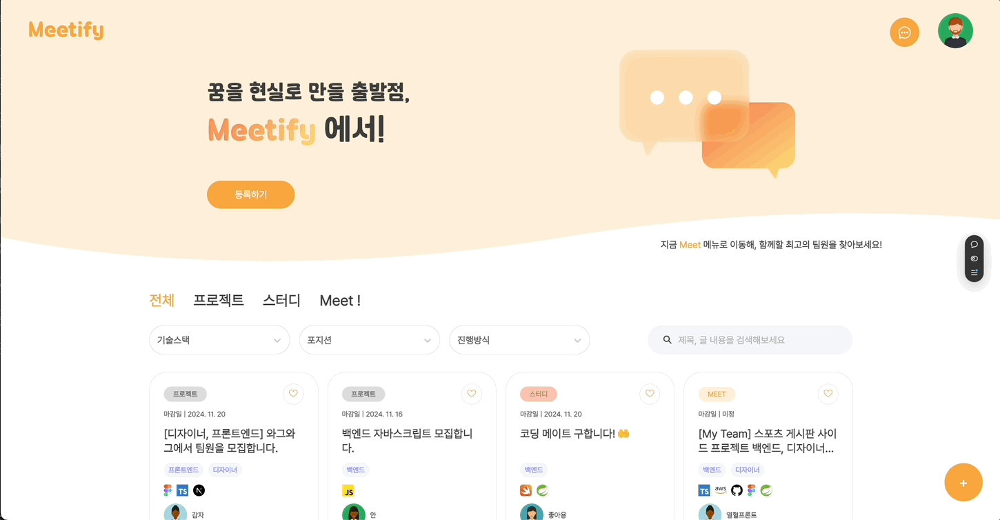
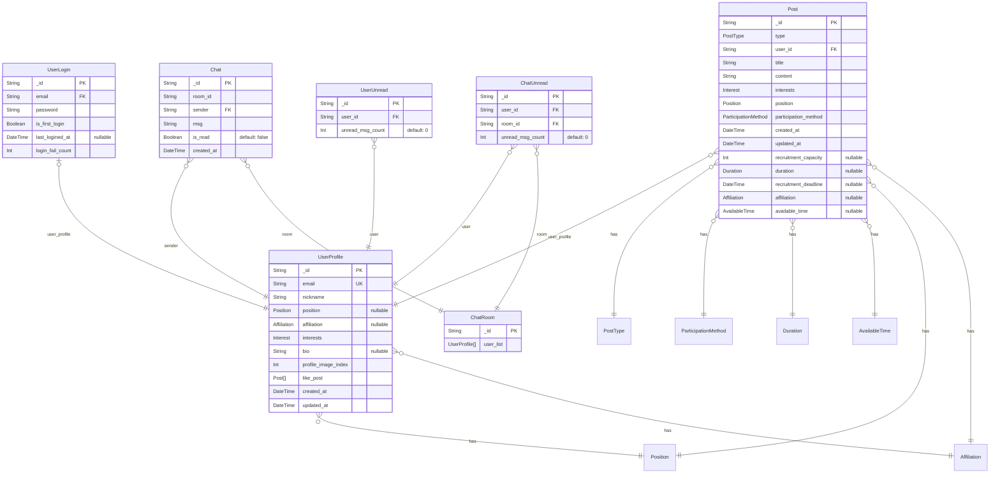

# 🤝 Meetify

<p align="center">
  
</p>

## 배포 주소

[meetify-team.vercel.app](https://meetify-team.vercel.app/)

## 백앤드 레포지토리

[meetify-backend](https://github.com/wilderif/meetify-backend)

## 팀원 소개

| 유상훈(팀장)                        | 김우종                                  | 김혜수                                  | 박아영                                  | 안준우                                |
| ----------------------------------- | --------------------------------------- | --------------------------------------- | --------------------------------------- | ------------------------------------- |
| [Yoos99](https://github.com/Yoos99) | [wilderif](https://github.com/wilderif) | [aaahyesu](https://github.com/aaahyesu) | [ayoung26](https://github.com/ayoung26) | [JW-Ahn0](https://github.com/JW-Ahn0) |

## 개발 기간

- 기획: 2024.10.17 ~ 2024.10.24
- 개발: 2024.10.25 ~ 2024.11.07

## 프로젝트 소개

Meetify는 프로젝트나 스터디를 함께할 팀원을 찾고, 자신의 역량과 관심사를 어필할 수 있는 매칭 플랫폼입니다.

### 기획 배경

- **기존 커뮤니케이션 채널의 한계 극복**

  - 오픈채팅, 이메일, 구글폼 등 분산된 연락 방식을 통합
  - 실시간 1:1 채팅으로 즉각적인 소통 가능

- **양방향 매칭 시스템 도입**
  - 프로젝트 주최자의 팀원 모집
  - 지원자의 역제안 서비스를 통한 효율적인 매칭

## 주요 구현 사항

### 1. 로그인 및 회원가입

- 모달 형태의 로그인/회원가입 UI
- 이메일 형식 및 비밀번호 유효성 검사
- 토스트 메시지를 통한 피드백 제공
- 로그인 상태 유지 기능

<details>
    <summary>로그인 미리보기</summary>
    
    
</details>

<details>
    <summary>회원가입 미리보기</summary>
    
</details>

### 2. 게시글 CRUD

- 프로젝트, 스터디, Meet(매칭요청) 별 차별화된 폼 구현
- 모집 인원, 기간, 기술 스택 등 상세 정보 입력
- 텍스트 에디터 지원

<details>
    <summary>게시글 작성 미리보기</summary>
    
</details>

<details>
    <summary>게시글 수정 및 삭제 미리보기</summary>
    
</details>

### 3. 검색 및 필터링

- 다중 필터 조건 지원 (기술 스택, 진행 방식 등)
- 키워드 검색 기능
- 페이지 페이지네이션 구현
- 새로운 게시글 표시 기능 구현
- 관심글 즐겨찾기 기능
- 관심글, 작성글 관리

<details>
    <summary>메인 검색 미리보기</summary>
    
</details>

<details>
    <summary>관심글 관리 미리보기</summary>
    
</details>

<details>
    <summary>작성글 관리 미리보기</summary>
    
</details>

### 4. 실시간 채팅 시스템

- Socket.io를 활용한 실시간 양방향 통신
- 읽지 않은 메시지 관리 및 알림
- 채팅방 목록 관리 및 최근 메시지 표시

<details>
    <summary>실시간 채팅 미리보기</summary>
    
</details>

### 5. 사용자 프로필 관리

- 기술 스택, 직무, 자기소개 등 사용자 정보 등록 및 수정

<details>
    <summary>사용자 프로필 관리 미리보기</summary>
    
</details>

## 기술 스택

### Frontend

- 코어: TypeScript, React
- 스타일: Styled-components
- 아이콘: React Icons
- 컴포넌트: Storybook
- 상태 관리: Zustand
- 라우팅: React Router
- 알림: React-toastify
- 채팅: Socket.io-client

### Backend

- 코어: TypeScript, Node.js, Express
- 데이터베이스: MongoDB, Prisma
- 인증: JWT
- 채팅: Socket.io

### Version Control & Collaboration

- Git, Github
- Postman
- Notion, Figma
- Zoom, Slack

## Database Schema



## 설치 및 실행

1. 레포지토리 클론
   ```bash
   git clone https://github.com/prgrms-fe-devcourse/NFE1-1-3-5team_Meetify-FE
   ```
2. 패키지 설치
   ```bash
   npm install
   ```
3. 환경 변수 설정
   프로젝트 루트에 `.env` 파일을 생성하고, 아래와 같이 설정
   ```bash
   VITE_API_URL = https://your-server-url.com/api
   ```
4. 프로젝트 실행
   ```bash
   npm run dev
   ```

## 테스트 계정

- 이메일: `meetify@naver.com`
- 비밀번호: `qwaszx12!@`

## 회고

<details>
    <summary>유상훈</summary>
    <p>
        다 같이 협력하여 무사히 프로젝트를 끝냈다는 게 감격스럽습니다 🙌 <br/>우여곡절도 많았지만 그만큼 배워가는 것도 많은 시간이었습니다 😊
    </p>
</details>

<details>
    <summary>김우종</summary>
    <p>
        설계와 백앤드, 프론트앤드 개발 그리고 배포까지 개발 과정 전반에 대한 경험을 두루 할 수 있어서 유익했습니다.<br/>협업 과정에 대해 많이 배우고 경험할 수 있어서 좋았습니다.
    </p>
</details>

<details>
    <summary>김혜수</summary>
    <p>
        팀원들과 기획부터 설계까지 끊임없이 소통하고 수정하면서 협력이란 무엇인가를 느낄 수 있었고,<br/> 하나의 기능씩 분산하여 프론트엔드-백엔드 구현을 진행하다보니 전체적인 개발 흐름을 이해할 수 있었던 것 같아 많은 것을 배운 프로젝트였습니다! 😊
    </p>
</details>

<details>
    <summary>박아영</summary>
    <p>
        이번 프로젝트로 협업의 중요성과 서버~클라이언트 개발흐름을 이해하면서 지식을 넓힐 수 있었습니다! <br/>팀원분들과 원활하게 소통하며 프로젝트를 완만하게 마무리하게 된 것 같아 만족스러워요 😊
    </p>
</details>

<details>
    <summary>안준우</summary>
    <p>
        협업을 본격적으로 하면서 진행하면서 소통에 큰 불화 없이 잘 진행된 것 같아 좋았습니다. <br/> 채팅을 한번 만들어보고 싶었는데 100%는 아니지만 그래도 어느 정도 목표를 달성한 것 같아 좋았습니다.
    </p>
</details>
